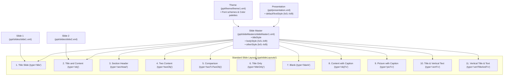

# Slide Masters & Layouts

Slide Masters and Slide Layouts provide the **template and semantic placeholder inheritance engine** for PowerPoint presentations.

---

## 3-Tier Template Architecture

Microsoft PowerPoint uses a 3-tier inheritance architecture to resolve shape styling, placeholder positions, and text defaults:



---

## Standard PowerPoint Slide Layouts

Every standard PowerPoint presentation provides 11 registered slide layouts under `slideMasters`:

| File | OpenXML `type` | Display Name | Standard Placeholders |
| :--- | :--- | :--- | :--- |
| `slideLayout1.xml` | `title` | **Title Slide** | Title (`ctrTitle`) + Subtitle (`subTitle`) |
| `slideLayout2.xml` | `obj` | **Title and Content** | Title + Content Placeholder (`idx="1"`) |
| `slideLayout3.xml` | `secHead` | **Section Header** | Large Section Title + Text |
| `slideLayout4.xml` | `twoObj` | **Two Content** | Title + 2 Side-by-Side Content Placeholders |
| `slideLayout5.xml` | `twoTxTwoObj` | **Comparison** | Title + 2 Column Headers + 2 Content Placeholders |
| `slideLayout6.xml` | `titleOnly` | **Title Only** | Title placeholder only |
| `slideLayout7.xml` | `blank` | **Blank** | Clean canvas without placeholders |
| `slideLayout8.xml` | `objTx` | **Content with Caption** | Content box on the left, caption on the right |
| `slideLayout9.xml` | `picTx` | **Picture with Caption** | Picture box on top, text underneath |
| `slideLayout10.xml` | `vertTx` | **Title and Vertical Text** | Vertical East-Asian text layouts |
| `slideLayout11.xml` | `vertTitleAndTx`| **Vertical Title and Text** | Vertical title + vertical body text |

---

## Working with Masters and Layouts

```typescript
import { Presentation } from '@hokkyss/pptx';

// 1. Load an existing corporate template or create new
const pres = await Presentation.load(templateBuffer);

// 2. Inspect masters and available layouts
const master = pres.getMaster('Office Theme');
const layouts = master?.getLayouts();

// 3. Add slide bound to a specific layout
const slide = pres.addSlide({
  master,
  layout: 'Title and Content',
});

// 4. Populate semantic placeholders
slide.addText('Executive Quarterly Report', { placeholder: 'title' });
slide.addText([
  {
    level: 0,
    bullet: true,
    runs: [
      { text: 'Q3 Enterprise Revenue: $48.2M (+22% YoY)', bold: true },
      { break: true },
      { text: '↳ Driven by cloud platform expansion.' },
    ],
  },
  {
    level: 1,
    bullet: true,
    text: 'Gross margin expanded by 340 bps to 78.4%.',
  },
], { placeholder: 'body' });
```

