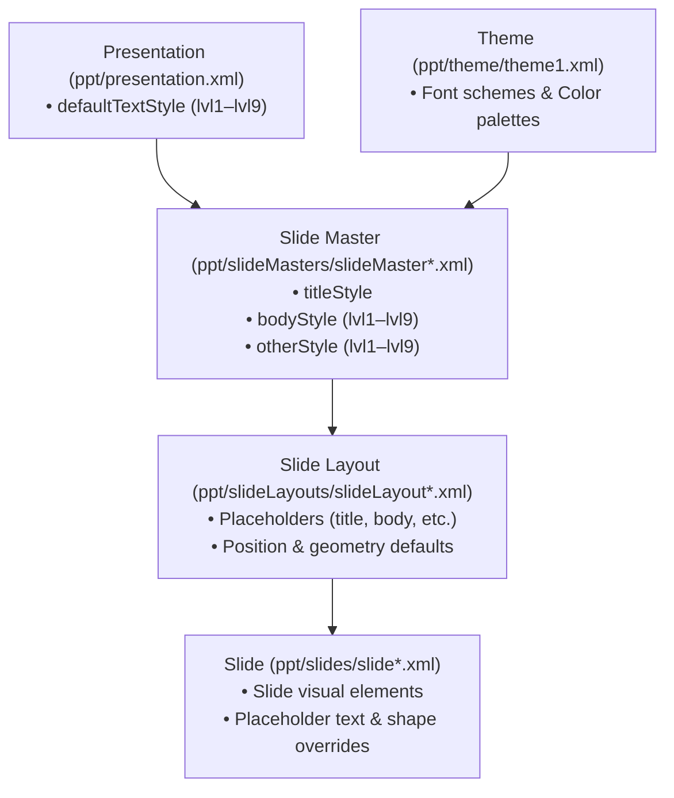

# Slide Masters & Layouts

Slide Masters and Slide Layouts provide the **template and semantic placeholder inheritance engine** for PowerPoint presentations.

---

## Template & Layout Inheritance Architecture

PowerPoint presentations resolve shape styling, placeholder positions, and text defaults through an inheritance cascade:



---

## Working with Templates and Layouts

When loading a presentation template via `Presentation.load(templateBuffer)`, you can discover its slide masters and bind newly added slides directly to its pre-defined layouts and semantic placeholders:

```typescript
import { Presentation } from '@hokkyss/pptx';

// 1. Load an existing corporate template
const pres = await Presentation.load(templateBuffer);

// 2. Discover masters and available layouts from the template
const masters = pres.getMasters();
const master = masters[0];
const layouts = master?.getLayouts() || [];

// 3. Add a slide bound to a specific layout from the template
const slide = pres.addSlide({
  master,
  layout: layouts[0]?.name,
});

// 4. Populate semantic placeholders
slide.addText('Executive Quarterly Report', { placeholder: 'title' });
slide.addText([
  {
    level: 0,
    bullet: true,
    runs: [
      { text: 'Q3 Enterprise Revenue: $48.2M (+22% YoY)', bold: true },
      { break: true },
      { text: '↳ Driven by cloud platform expansion.' },
    ],
  },
  {
    level: 1,
    bullet: true,
    text: 'Gross margin expanded by 340 bps to 78.4%.',
  },
], { placeholder: 'body' });
```

---

## Discovering Placeholders

You can query all placeholders declared on a slide or layout:

```typescript
// Query all placeholders available on a slide
const placeholders = slide.getPlaceholders();
for (const ph of placeholders) {
  console.log(`Placeholder type=${ph.type}, idx=${ph.idx}`);
}
```

